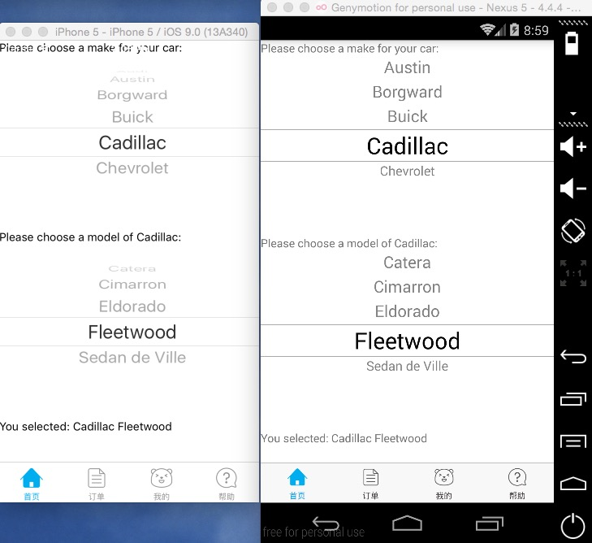

# react-native-picker-android

PickerAndroid has PickerIOS interface in pure javascript

###Warn
if 0.14.2 <= react-native <=0.24 `npm install react-native-picker-android@0.3.8 --save`  
if 0.24 < react-native `npm install react-native-picker-android --save`

###Documentation

####Props
- <b>pickerStyle</b> viewStylePropType
- <b>itemStyle</b> textStylePropType
- <b>selectedValue</b> any
- <b>onValueChange</b> function

####Methods
- <b>moveUp</b> when called, the wheel will go up, which will trigger onValueChange
- <b>moveDown</b> when called, the wheel will go down, which will trigger onValueChange too.

###Usage

####Step 1 - install

```
npm install react-native-picker-android --save
```

####Step 2 - import and use in project
```javascript
'use strict';

import React, {
	View,
	Text,
	Platform,
	PickerIOS
} from 'react-native';

import PickerAndroid from 'react-native-picker-android';

let Picker = Platform.OS === 'ios' ? PickerIOS : PickerAndroid;
let PickerItem = Picker.Item;

let CAR_MAKES_AND_MODELS = {
	amc: {
		name: 'AMC',
		models: ['AMX', 'Concord', 'Eagle', 'Gremlin', 'Matador', 'Pacer'],
	},
	alfa: {
		name: 'Alfa-Romeo',
		models: ['159', '4C', 'Alfasud', 'Brera', 'GTV6', 'Giulia', 'MiTo', 'Spider'],
	},
	aston: {
		name: 'Aston Martin',
		models: ['DB5', 'DB9', 'DBS', 'Rapide', 'Vanquish', 'Vantage'],
	},
	audi: {
		name: 'Audi',
		models: ['90', '4000', '5000', 'A3', 'A4', 'A5', 'A6', 'A7', 'A8', 'Q5', 'Q7'],
	},
	austin: {
		name: 'Austin',
		models: ['America', 'Maestro', 'Maxi', 'Mini', 'Montego', 'Princess'],
	},
	borgward: {
		name: 'Borgward',
		models: ['Hansa', 'Isabella', 'P100'],
	},
	buick: {
		name: 'Buick',
		models: ['Electra', 'LaCrosse', 'LeSabre', 'Park Avenue', 'Regal', 'Roadmaster', 'Skylark'],
	},
	cadillac: {
		name: 'Cadillac',
		models: ['Catera', 'Cimarron', 'Eldorado', 'Fleetwood', 'Sedan de Ville'],
	},
	chevrolet: {
		name: 'Chevrolet',
		models: ['Astro', 'Aveo', 'Bel Air', 'Captiva', 'Cavalier', 'Chevelle', 'Corvair', 'Corvette', 'Cruze', 'Nova', 'SS', 'Vega', 'Volt'],
	},
};

export default class SomeScene extends React.Component {

	constructor(props, context){
		super(props, context);
		this.state = {
			carMake: 'cadillac',
			modelIndex: 3,
		}
	}

	render() {
		let make = CAR_MAKES_AND_MODELS[this.state.carMake];
		let selectionString = make.name + ' ' + make.models[this.state.modelIndex];
		return (
			<View>
				<Text>Please choose a make for your car:</Text>
				<Picker
					selectedValue={this.state.carMake}
					onValueChange={(carMake) => this.setState({carMake, modelIndex: 0})}>
					{Object.keys(CAR_MAKES_AND_MODELS).map((carMake) => (
						<PickerItem
							key={carMake}
							value={carMake}
							label={CAR_MAKES_AND_MODELS[carMake].name}
						/>
					))}
				</Picker>
				<Text>Please choose a model of {make.name}:</Text>
				<Picker
					selectedValue={this.state.modelIndex}
					key={this.state.carMake}
					onValueChange={(modelIndex) => this.setState({modelIndex})}>
					{CAR_MAKES_AND_MODELS[this.state.carMake].models.map((modelName, modelIndex) => (
						<PickerItem
							key={this.state.carMake + '_' + modelIndex}
							value={modelIndex}
							label={modelName}
						/>
					))}
				</Picker>
				<Text>You selected: {selectionString}</Text>
			</View>
		);
	}
};
```
